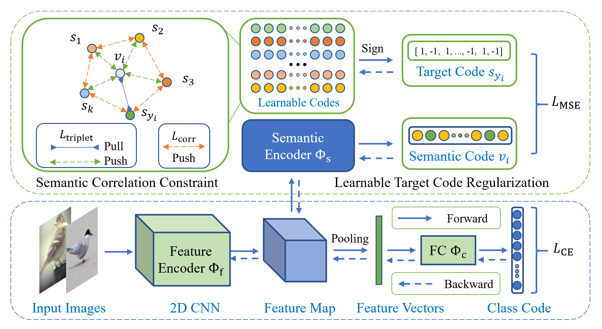

# LTC: Improving Deep Representation Learning via Auxiliary Learnable Target Coding
This is a Pytorch implementation of the paper [LTC](https://arxiv.org/abs/2305.18680).

Deep representation learning is a subfield of machine learning that focuses on learning meaningful and useful representations of data through deep neural networks. 
However, existing methods for semantic classification typically employ pre-defined target codes such as the one-hot and the Hadamard codes, 
which can either fail or be less flexible to model inter-class correlation. 
In light of this, this paper introduces a novel learnable target coding as an auxiliary regularization of deep representation learning, 
which can not only incorporate latent dependency across classes but also impose geometric properties of target codes into representation space. 
Specifically, a margin-based triplet loss and a correlation consistency loss on the proposed target codes are designed to encourage more discriminative representations 
owing to enlarging between-class margins in representation space and favoring equal semantic correlation of learnable target codes respectively.

For more details, please refer to our [paper](https://arxiv.org/abs/2305.18680).

## Method Overview


## Setup
### Install Package Dependencies
```
torch torchvision
PyYAML easydict tqdm scikit-learn efficientnet_pytorch pandas opencv-python colorama tensorboardX
```
## Datasets
Download [CUB-200-2011](http://www.vision.caltech.edu/visipedia/CUB-200-2011.html), 
[Stanford Cars](https://ai.stanford.edu/~jkrause/cars/car_dataset.html),
and [FGVC-Aircraft](http://www.robots.ox.ac.uk/~vgg/data/fgvc-aircraft/) datasets to `./data`, 
or change the data root in the `./datasets/xxx.py` for each dataset.

## Training & Evaluation
To train a baseline on the CUB dataset with the Resnet18 backbone.

``` python main.py --dataset cub --netname resnet18 --seed 1 ```

To train the proposed learnable target coding method on the CUB dataset with the Resnet18 backbone.

``` python main.py --dataset cub --netname resnet18 --seed 1 --LTC```

To train the Hadamard target coding method on the CUB dataset with the Resnet18 backbone.

``` python main.py --dataset cub --netname resnet18 --seed 1 --HTC```


To train model on other datasets using other network backbones, you can specify the following arguments:

``` --netname: name of network architecture (for example: resnet34, resnet50, ...) ```

``` --dataset: name of dataset  (for example: cub, car, aircrft, ...)```

More hype-parameters are introduced in the `./utils/conf.py`.

## Performance
### Performance compared with SOTA methods on CUB-200-2011
| Method     | Backbone | CUB (\%) | CAR (\%) | AIR (\%) |
|------------|----------|----------|----------|----------|
| Baseline   | ResNet18 | 81.88    | 90.45    | 88.60    |
| DTRG       | ResNet18 | 84.52    | 91.99    | 90.28    |
| HTC        | ResNet18 | 83.19    | 91.54    | 88.93    |
| LTC (Ours) | ResNet18 | 84.07    | 92.67    | 90.91    |
| Baseline   | ResNet34 | 84.82    | 91.94    | 89.98    |
| DTRG       | ResNet34 | 85.66    | 93.32    | 91.54    |
| HTC        | ResNet34 | 85.35    | 92.97    | 91.33    |
| LTC (Ours) | ResNet34 | 85.55    | 94.08    | 92.35    |
| Baseline   | ResNet50 | 85.46    | 92.89    | 90.97    |
| DTRG       | ResNet50 | 87.29    | 94.31    | 92.12    |
| HTC        | ResNet50 | 86.33    | 93.92    | 91.36    |
| LTC (Ours) | ResNet50 | 86.90    | 94.27    | 92.77    |

## Citation
If you find our paper and repo useful, please cite our paper.
```commandline
@article{liu2023improving,
  title={Improving Deep Representation Learning via Auxiliary Learnable Target Coding},
  author={Liu, Kangjun and Chen, Ke and Wang, Yaowei and Jia, Kui},
  journal={arXiv preprint arXiv:2305.18680},
  year={2023}
}
```
## Contact
If you have any questions about our work, feel free to contact us through email (wikangj.liu@mail.scut.edu.cn) or Github issues.

## Reference
Some code and training settings are borrowed from PyTorch implementation of [DTRG](https://github.com/AkonLau/DTRG).
